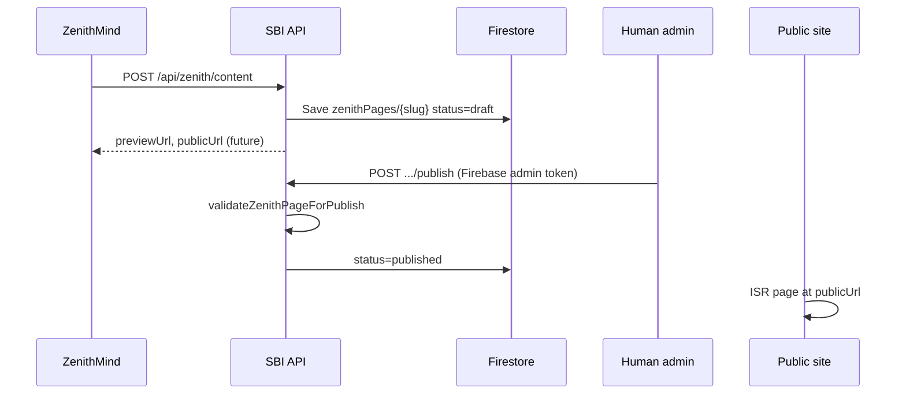

# ZenithMind → Sales Breakdown Institute — Integration Guide

This document is the **authoritative integration spec** for ZenithMind (or any automated content producer) submitting pages to **salesbreakdowninstitute.com**.

**Production base URL:** `https://salesbreakdowninstitute.com`  
**Content spec:** Zenith Content **v1.2** (component JSON — **no raw HTML or CSS** from ZenithMind)

---

## 1. Overview

### What ZenithMind does

1. **Build** a structured JSON page (`ZenithPage`) with typed `components[]`.
2. **POST** it to the ingestion API (authenticated).
3. The site stores the page as **`draft`** in Firestore (`zenithPages/{slug}`).
4. A human **admin publishes** the page in `/app/admin/zenith` (ZenithMind cannot go live automatically).

### What ZenithMind must not do

- Send `"status": "published"` expecting immediate public visibility — ingestion **always** saves **`draft`**.
- Send arbitrary HTML/CSS for layout (the site renders components).
- Send GHL tags from the browser on form submit (tags are resolved **server-side** from stored page config).
- Use reserved top-level slugs for `landing_page` content (see §4).

### Two ingestion systems (use v1.2 for new work)

| System | Endpoints | Storage | Use when |
| --- | --- | --- | --- |
| **Zenith Content v1.2** (preferred) | `POST /api/zenith/content`, `POST /api/zenith/content/bulk` | `zenithPages` | Full visual pages (articles, guides, webinars, landings, etc.) |
| **Legacy structured docs** | `POST /api/zenith/articles`, `landing-pages`, `lead-magnets`, `batch` | `articles`, `landingPages`, `leadMagnets` | Older article/landing/lead-magnet document shapes only |

**Default recommendation:** submit all new marketing pages via **v1.2** (`/api/zenith/content`).

### GoHighLevel (CRM) — Private Integration

Lead capture and tags sync to GHL **server-side** via a **Private Integration** (PIT), not browser keys and not legacy v1 API keys.

| Env (Vercel / server only) | Purpose |
| --- | --- |
| `GHL_PIT_TOKEN` | Private Integration token from GHL → Settings → Other Settings → **Private Integrations** (`pit-…`) |
| `GHL_LOCATION_ID` | Sub-account location ID (required for contact search/create) |
| `GHL_API_BASE_URL` | `https://services.leadconnectorhq.com` (default) |

Minimum PIT scopes: **View Contacts**, **Edit Contacts**, **View Locations**. Full setup: `docs/GHL_API_Integration_Notes.md`. Verify: `npm run ghl:diagnose`.

### 1.1 Which API for which content? (quick reference)

| What you are building | Preferred approach | API | Firestore collection | Public URL (after publish) |
| --- | --- | --- | --- | --- |
| **Zenith visual page** (any layout below) | v1.2 | `POST /api/zenith/content` | `zenithPages` | See §5.2 by `contentType` |
| Zenith **article** (research longread) | v1.2 `contentType: "article"` | same | `zenithPages` | `/articles/{slug}` |
| Zenith **campaign landing** (paid ad LP) | v1.2 `contentType: "landing_page"` | same | `zenithPages` | `/{slug}` |
| Zenith **lead magnet guide** (PDF opt-in) | v1.2 `contentType: "lead_magnet_page"` | same | `zenithPages` | `/guides/{slug}` |
| Zenith **webinar** registration | v1.2 `contentType: "webinar_page"` | same | `zenithPages` | `/webinars/{slug}` |
| Zenith **CTA / upload** page | v1.2 `contentType: "cta_page"` | same | `zenithPages` | `/cta/{slug}` |
| Zenith **research** page | v1.2 `contentType: "research_page"` | same | `zenithPages` | `/research/{slug}` |
| **Legacy article** (structured doc, no components) | Legacy | `POST /api/zenith/articles` | `articles` | `/articles/{slug}` |
| **Legacy landing page** (hero/sections form) | Legacy | `POST /api/zenith/landing-pages` | `landingPages` | `/{slug}` |
| **Legacy lead magnet record** (metadata + `fileUrl`) | Legacy | `POST /api/zenith/lead-magnets` | `leadMagnets` | Used by landings/forms, not a Zenith route |
| Mixed legacy batch | Legacy | `POST /api/zenith/batch` | multiple | per row above |

**Important:** A PDF guide lander for ads is usually **`lead_magnet_page`** at **`/guides/{slug}`**, not `landing_page` at `/{slug}`. See §5.3.

---

## 2. Authentication

Every ingestion request must include the shared secret (minimum **16 characters**), configured on the server as:

- `ZENITH_CONTENT_SECRET` (preferred for v1.2), or
- `ZENITH_INGEST_SECRET` (fallback if content secret unset)

### Headers (either is fine)

```http
Authorization: Bearer <SECRET>
```

or

```http
x-zenith-secret: <SECRET>
```

### Health check

```http
GET /api/zenith/health
Authorization: Bearer <SECRET>
```

**200 example:**

```json
{
  "ok": true,
  "service": "zenith-ingestion",
  "timestamp": "2026-05-20T12:00:00.000Z"
}
```

**401** — wrong or missing secret.  
**500** — secret not configured on the server (contact SBI ops).

---

## 3. Primary API — single page (v1.2)

### `POST /api/zenith/content`

Creates or **fully replaces** the draft at `zenithPages/{slug}`.

**Request**

```http
POST https://salesbreakdowninstitute.com/api/zenith/content
Authorization: Bearer <SECRET>
Content-Type: application/json

{ ... ZenithPage JSON ... }
```

**Success (201 created / 200 updated)**

```json
{
  "ok": true,
  "mode": "created",
  "slug": "why-good-calls-dont-close",
  "status": "draft",
  "previewUrl": "/preview/why-good-calls-dont-close",
  "publicUrl": "/guides/why-good-calls-dont-close",
  "ogImageUrl": "/api/og/why-good-calls-dont-close"
}
```

| Field | Meaning |
| --- | --- |
| `mode` | `"created"` or `"updated"` |
| `status` | Always `"draft"` after ingestion |
| `previewUrl` | Admin-only preview (requires sign-in) |
| `publicUrl` | Path **after** admin publish (based on `contentType`) |
| `ogImageUrl` | OG image endpoint or CDN URL |

**Validation failure (400)**

```json
{
  "ok": false,
  "errors": [
    "components[2] lead-form requires destination",
    "ogImage must include cdnUrl or a valid template"
  ]
}
```

### `GET /api/zenith/content?slug={slug}`

Same secret (or Firebase admin token). Returns stored page JSON.

```http
GET https://salesbreakdowninstitute.com/api/zenith/content?slug=why-good-calls-dont-close
Authorization: Bearer <SECRET>
```

---

## 4. Bulk API (v1.2)

### `POST /api/zenith/content/bulk`

```json
{
  "pages": [
    { "...page 1..." },
    { "...page 2..." }
  ]
}
```

**Response**

```json
{
  "ok": true,
  "results": [
    { "ok": true, "slug": "page-a", "mode": "created", "status": "draft" },
    { "ok": false, "slug": "bad-page", "errors": ["..."] }
  ]
}
```

| HTTP status | Meaning |
| --- | --- |
| **201** | All succeeded; at least one created |
| **200** | All succeeded; all updates |
| **207** | Mixed success and failure |
| **400** | All failed |

Process each `results[]` entry independently. Fix failed slugs and re-submit those pages only.

### 4.1 Landing page + thank-you page in one bulk request (recommended)

Submit **both** pages in a single `POST /api/zenith/content/bulk` body, then publish each from admin (or publish both after reviewing drafts).

**ZenithMind does not need `thankYouPageUrl` on the LP** when the paired TY page is in the same `pages[]` array. The server:

1. Finds the `cta_page` whose **title** matches the LP (after stripping a leading `Thank You` / `Thank you:` prefix from the TY title).
2. Prefers **`leadMagnetId`** when set on the LP (TY slug/title key e.g. `the-call-felt-fine` → `/cta/thank-you-the-call-felt-fine`).
3. Falls back to TY slug `thank-you-{lp.slug}`.
4. Writes the resolved path into every `lead-form` / `forensic-download-section.form` on the LP.

**Title pairing example**

| Page | `contentType` | `title` | `slug` |
| --- | --- | --- | --- |
| LP | `landing_page` | `The Call Felt Fine` | `why-good-calls-dont-close` |
| TY | `cta_page` | `Thank You — The Call Felt Fine` | `thank-you-the-call-felt-fine` |

Optional LP field **`thankYouPageTitle`**: exact TY `title` string when auto-matching is ambiguous.

**Single LP ingest** (no TY in the same request): server defaults redirect to `/cta/thank-you-{leadMagnetId or title-key}` — publish a TY page at that slug before go-live.

Bulk `results[]` entries for successful LPs may include **`thankYouPageUrl`** (resolved redirect path).

---

## 5. Top-level page JSON (`ZenithPage`)

### Required fields

| Field | Type | Rules |
| --- | --- | --- |
| `source` | string | Must be exactly `"zenithmind"` |
| `contentType` | string | One of §6 |
| `slug` | string | URL-safe; see §5.1 |
| `components` | array | Non-empty; every item must validate (§7) |
| `ogImage` | object | `cdnUrl` **or** valid `template` (§8) |

### Strongly recommended

| Field | Purpose |
| --- | --- |
| `id` | Stable id; defaults to `slug` if omitted |
| `title` | Page title; used in SEO fallbacks |
| `seo` | `metaTitle`, `metaDescription`, `canonicalPath` |
| `componentSpecVersion` | Omit — server sets `"1.2"` |
| `submittedBy` | Optional string (default `"zenithmind"`) |

### Optional

| Field | Purpose |
| --- | --- |
| `keyword` | Object (SEO clustering metadata) |
| `leadMagnetId` | Optional metadata link to a lead magnet **id** (see §5.3 — does **not** wire forms by itself on v1.2) |
| `relatedArticleSlugs` | string[] |
| `schema` | e.g. `{ "type": "Article" }` |
| `ghlTagStrategy` | Page-level GHL tag overrides for **all** `lead-form` submits on this page (§10) |

### Ignored on ingest

| Field | Behavior |
| --- | --- |
| `status` | If sent as `"published"`, stored as **`draft`** anyway |
| `createdAt` / `updatedAt` / `publishedAt` | Server manages timestamps on publish |

### 5.1 Slug rules

- Lowercase letters, digits, hyphens only: `^[a-z0-9]+(?:-[a-z0-9]+)*$`
- Examples: `why-good-calls-dont-close`, `seven-hidden-moments-guide`
- Normalize: trim, lowercase, replace non-alphanumerics with `-`, collapse hyphens

**Reserved slugs** (do **not** use for `contentType: "landing_page"` — conflicts with site routes):

`about`, `research`, `programs`, `insights`, `contact`, `privacy`, `terms`, `where-deals-break`, `app`, `api`, `articles`, `admin`, `guides`, `webinars`, `cta`, `preview`

`lead_magnet_page` slugs live under `/guides/{slug}` and are not top-level, so they do not hit this list.

### 5.2 Public URLs by `contentType`

| `contentType` | Public path (after publish) |
| --- | --- |
| `article` | `/articles/{slug}` |
| `landing_page` | `/{slug}` |
| `lead_magnet_page` | `/guides/{slug}` |
| `webinar_page` | `/webinars/{slug}` |
| `cta_page` | `/cta/{slug}` |
| `research_page` | `/research/{slug}` |

Set `seo.canonicalPath` to the public path when possible (e.g. `/guides/seven-hidden-moments-guide`).

**Slug collision note:** Legacy `articles` / `landingPages` collections take precedence over Zenith for the same slug on public routes. Coordinate with admins if reusing slugs.

### 5.3 Associating a lead magnet with a page

There are **three related concepts** — do not confuse them:

| Concept | What it is | How ZenithMind sets it |
| --- | --- | --- |
| **Lead magnet record** | Metadata in `leadMagnets` (legacy API) or implied by guide page slug | `POST /api/zenith/lead-magnets` with `id`, `fileUrl`, `ghlTag`, etc. |
| **PDF file** | Static asset visitors download | Host at `https://salesbreakdowninstitute.com/assets/{filename}.pdf` (repo `public/assets/`) |
| **Form + GHL wiring** | Which funnel runs when someone opts in | **`lead-form.destination`** = `lead-magnet:{id}` (v1.2) |

#### v1.2 Zenith pages (preferred)

1. **Create the guide page** as `contentType: "lead_magnet_page"` with slug e.g. `the-call-felt-fine` → public URL `/guides/the-call-felt-fine`.
2. **Wire the form** — every `lead-form` (and matching hero CTAs) must use the same destination:

   ```json
   "destination": "lead-magnet:the-call-felt-fine"
   ```

   The `{id}` after `lead-magnet:` is the magnet identifier (URL-safe slug segment). It should match the guide slug unless you intentionally use a shorter id (then stay consistent everywhere).
3. **Optional top-level `leadMagnetId`** on the Zenith page — stored for reference / articles; **forms do not read this field**. Wiring is always via `destination`.
4. **PDF URL** — put the download link in copy or thank-you text, e.g. `/assets/the-call-felt-fine.pdf`. There is no automatic PDF field on v1.2 ingest.

#### v1.2 Zenith `landing_page` (top-level `/{slug}`)

Campaign landings that promote a magnet should still use **`lead-form.destination": "lead-magnet:{id}"`** on the form component. Top-level `leadMagnetId` on `ZenithPage` is optional metadata only.

#### v1.2 Zenith `article`

Optional `"leadMagnetId": "7-hidden-moments"` links the article to a magnet id for display/internal reference. CTAs inside the article should still use `destination: "lead-magnet:…"` or `call-upload` on `inline-cta` / `footer-cta`.

#### Legacy landing pages (`POST /api/zenith/landing-pages`)

Legacy landings use **document fields**, not component destinations:

```json
{
  "landingPage": {
    "slug": "sales-call-analysis",
    "primaryLeadMagnetId": "sales-call-autopsy-checklist",
    "leadMagnetIds": ["sales-call-autopsy-checklist"],
    "conversion": {
      "formType": "lead_magnet",
      "ghlTags": ["lead_magnet:sales-call-autopsy"],
      "ghlTagStrategy": { "mode": "merge", "tags": ["sbi --> campaign x"] },
      "thankYouMessage": "...",
      "nextStep": "download"
    }
  }
}
```

Rules:

- **`primaryLeadMagnetId`** — main magnet this landing promotes; must also appear in **`leadMagnetIds`**.
- **`leadMagnetIds`** — all magnets offered or referenced on this page (at least one).
- Opt-in GHL tags come from **`conversion.ghlTagStrategy`** / legacy **`conversion.ghlTags`** (see §10.1), not from the browser.

Legacy opt-in uses tags like `sbi lead magnet --> {primaryLeadMagnetId}` on the server.

#### Legacy articles (`POST /api/zenith/articles`)

Optional **`leadMagnetId`** on the article document plus **`relatedLandingPageSlug`** to tie editorial content to a campaign landing.

---

## 6. Content types and required components (publish)

Ingestion validates **components** loosely; **admin publish** enforces stricter rules.  
Build pages that satisfy **both** tables below to avoid publish failures.

### 6.1 `article`

**Public URL:** `/articles/{slug}`

**Required components for publish:**

| Component `type` | Required fields |
| --- | --- |
| `aeo-answer-block` | `answer` (non-empty string) |
| `body-section` | (flexible) |
| `transcript-block` | At least one of: `timestamp`, `exchanges[]`, `signals[]` |
| `faq-section` | `faqs[]` with `{ question, answer }` |
| `footer-cta` | (flexible) |

**Warning (publish allowed):** exactly **3** `inline-cta` components recommended.

**Default OG template:** `forensic-article`

---

### 6.2 `landing_page`

**Public URL:** `/{slug}` (must not be a reserved slug)

**Required components for publish:**

`page-hero`, `aeo-answer-block`, `body-section`, `lead-form`, `faq-section`, `footer-cta`

**Landing page opt-in rules:**

- Forms must collect **`name` and `email`** (`fields: ["name", "email"]`). Email-only forms are rejected at ingest for `landing_page`.
- **`thankYouPageUrl` is optional** when you submit the LP together with its thank-you page (see §4.1). The server sets redirect URLs automatically.
- After submit and GHL tagging, the browser redirects to the thank-you page.

**Default OG template:** `forensic-article`

---

### 6.3 `lead_magnet_page`

**Public URL:** `/guides/{slug}`

**Required components for publish:**

| Component | Notes |
| --- | --- |
| `page-hero` | Eyebrow, headline, subheadline, CTAs |
| `body-section` | Main copy |
| `lead-form` | `variant`, `destination` required |

**Default OG template:** `lead-magnet`

**Lead magnet PDF assets:** Host files under `https://salesbreakdowninstitute.com/assets/{filename}.pdf` (e.g. `/assets/the-call-felt-fine.pdf`). Reference that URL in copy or post-submit messaging — not via a special API field.

---

### 6.4 `webinar_page`

**Public URL:** `/webinars/{slug}`

**Required for publish:** `page-hero`, `body-section`, `lead-form`, `speaker-block`, `webinar-urgency-block`

**Default OG template:** `webinar-event`

---

### 6.5 `cta_page`

**Public URL:** `/cta/{slug}`

**Required for publish:** `page-hero`, `lead-form`

**Default OG template:** `cta-upload`

---

### 6.6 `research_page`

**Public URL:** `/research/{slug}`

**Required for publish:** `body-section`, `transcript-block`

**Default OG template:** `research-report`

---

## 7. Component catalog (v1.2)

Allowed `type` values (unknown types are **rejected**):

`page-hero`, `aeo-answer-block`, `body-section`, `transcript-block`, `signal-breakdown`, `inline-cta`, `faq-section`, `lead-form`, `footer-cta`, `lead-magnet-callout`, `quote-block`, `research-callout`, `speaker-block`, `webinar-urgency-block`, `comparison-table`

### 7.1 `page-hero`

```json
{
  "type": "page-hero",
  "eyebrow": "FREE GUIDE",
  "headline": "Seven Hidden Moments",
  "subheadline": "Read the signals your champion cannot name.",
  "variant": "default",
  "primaryCta": { "label": "Download", "destination": "lead-magnet:the-call-felt-fine" },
  "secondaryCta": { "label": "Learn more", "destination": "contact-inbox" }
}
```

CTAs require both `label` and `destination`.

### 7.2 `aeo-answer-block`

```json
{
  "type": "aeo-answer-block",
  "answer": "One direct paragraph answering the core search intent."
}
```

Used for SEO/AEO and as fallback meta description on publish.

### 7.3 `body-section`

```json
{
  "type": "body-section",
  "heading": "Why this matters",
  "body": "Prose paragraph(s).",
  "bullets": ["Point one", "Point two"],
  "emphasis": "callout"
}
```

### 7.4 `transcript-block`

```json
{
  "type": "transcript-block",
  "timestamp": "31:14",
  "attribution": "Anonymized reconstruction.",
  "exchanges": [{ "speaker": "Rep", "line": "..." }],
  "signals": [{ "label": "Hesitation", "description": "..." }],
  "verdict": "deal-shifted"
}
```

### 7.5 `faq-section`

```json
{
  "type": "faq-section",
  "faqs": [
    { "question": "Who is this for?", "answer": "B2B revenue leaders..." }
  ]
}
```

### 7.6 `lead-form` (critical)

```json
{
  "type": "lead-form",
  "variant": "lead-magnet-capture",
  "headline": "Send the guide",
  "description": "We will email the PDF.",
  "ctaText": "Email me the PDF",
  "destination": "lead-magnet:the-call-felt-fine",
  "fields": ["name", "email"],
  "thankYouMessage": "Check your inbox.",
  "ghlTagStrategy": { "mode": "merge", "tags": ["sbi --> zenith guide"] }
}
```

| Field | Required | Notes |
| --- | --- | --- |
| `variant` | **Yes** | e.g. `lead-magnet-capture`, `call-upload`, `webinar-signup`, `contact` |
| `destination` | **Yes** | Registry string (§9) |
| `thankYouPageUrl` | No* | Auto-set from paired `cta_page` in bulk (§4.1) or default `/cta/thank-you-{key}`; override if needed |
| `fields` | **Yes** on `landing_page` | Must be `["name", "email"]` (enforced at ingest) |
| `thankYouMessage` | No | Inline fallback if redirect is blocked; usually omit when using `thankYouPageUrl` |
| `redirect` | Deprecated | Alias for `thankYouPageUrl` |
| `ghlTags` | Deprecated | Use `ghlTagStrategy` |
| `ghlTagStrategy` | No | Overrides page-level strategy |
| `acceptedFileTypes` | No | For upload variants |

### 7.7 `inline-cta` / `footer-cta`

```json
{
  "type": "inline-cta",
  "variant": "urgency",
  "headline": "...",
  "subtext": "...",
  "cta": { "label": "Upload Your Call", "destination": "call-upload" }
}
```

### 7.8 Other components

Optional enrichments: `signal-breakdown`, `lead-magnet-callout`, `quote-block`, `research-callout`, `speaker-block`, `webinar-urgency-block`, `comparison-table` — see fixtures in repo `src/lib/zenith/__fixtures__/`.

**LP1-only component types** (optional; not required for publish): `credibility-bar`, `moment-list`, `why-miss-section`, `forensic-download-section`. Full example: `docs/examples/zenith-lp1-forensic-landing-page-request.json`.

### 7.9 Visual variants (LP / TY prototypes, 2026-05-20)

**SBI Renderer — Component Expansion Spec.** These are the visual elements from the LP and TY HTML prototypes. ZenithMind submits JSON only (no CSS). The renderer applies styles from `src/components/zenith/zenith-variants.css`.

**Rules:**

- Set `variant` on an existing `type` where possible; LP1 also adds optional types listed below.
- Unknown `variant` strings are accepted at ingest; the renderer falls back to the default layout for that `type` if unimplemented.
- Full-bleed navy sections break out of the page shell to viewport width automatically.

#### LP1 forensic landing page variants

Reference payload: `docs/examples/zenith-lp1-forensic-landing-page-request.json`.

| `type` | `variant` | Key fields |
| --- | --- | --- |
| `page-hero` | `forensic-navy` | `microProof`, `forensicArtifact` (see below) |
| `body-section` | `stat-callout`, `story-file` | `stat`, `verdictRows`, `paragraphs` |
| `inline-cta` | `urgency` | `headline`, `subtext`, `cta` |
| `transcript-block` | `case-file` | `exchanges[].marker.note`, `summary` |
| `signal-breakdown` | `evidence-cards` | `signals[].number`, `label`, `description` |
| `credibility-bar` | `forensic` | `text`, `emphasis[]` |
| `moment-list` | `forensic-moments` | `moments[]` |
| `why-miss-section` | `forensic` | `blocks[]`, `closing` |
| `forensic-download-section` | `evidence-file` | `card`, `form.destination`, `form.thankYouPageUrl`, `form.fields` (`name`, `email`), `id` (e.g. `"lead"`) |
| `footer-cta` | `forensic-final` | `headline`, `body`, `cta` |

**`forensicArtifact`** (on `page-hero`): `caseId`, `status`, `waveform[]` (`tone`, `height`), `driftPositionPercent`, `driftLabel`, `timestamps[]`, `exchanges[]` (`line`, `highlight`, `marker`, `markerTone`, `annotation`), `verdictLabel`, `verdict`, `footer`.

**`microProof`**: `buyerLabel`, `buyerLine`, `analysisLabel`, `analysisLine`.

| `type` | `variant` | Typical pages |
| --- | --- | --- |
| `page-hero` | `forensic-navy` | LP1 (`why-good-calls-dont-close`) |
| `page-hero` | `tool-strip` | LP2 (`what-your-recordings-reveal`) |
| `transcript-block` | `case-file` | LP1 |
| `body-section` | `stat-callout` | LP1 |
| `body-section` | `story-file` | LP1 |
| `body-section` | `layer-diagram` | LP2 |
| `body-section` | `sherpa-bridge` | TY1, TY2, TY3 |
| `signal-breakdown` | `evidence-cards` | TY1, TY2, TY3 |
| `comparison-table` | `before-after` | LP2 |
| `research-callout` | `artifact-box` | TY1, TY2, TY3 |
| `quote-block` | `micro-proof` | LP1, LP2, LP3 |

#### 7.9.0 Design tokens (renderer reference)

Colors and layout tokens used by variant CSS (do not send in JSON):

| Token | Value |
| --- | --- |
| `--navy-deep` | `#0d1b38` |
| `--navy-mid` | `#162d54` |
| `--navy-dark` | `#080f1e` |
| `--red` | `#9b1c1c` |
| `--red-btn` | `#c41e1e` |
| `--red-light` | `#e87070` |
| `--green` | `#22c55e` |
| `--amber` | `#f59e0b` |
| `--zenith-max` | `1100px` |
| `--zenith-gutter` | `clamp(1.25rem, 5vw, 3rem)` |

Fonts: `--zenith-serif` (Source Serif 4), `--zenith-sans` (Inter), `--zenith-mono` (Courier New).

#### 7.9.1 Ingest gotchas (read before submitting)

| Component / variant | Rule |
| --- | --- |
| `comparison-table` / `before-after` | `rows` must be `[{ "a": "...", "b": "..." }, ...]`. Nested `rows: [["a","b"]]` is **rejected**. |
| `transcript-block` / `case-file` | Exchanges use `salesperson` + `buyer` (not `speaker` + `line`). Optional `marker` object per exchange. |
| `transcript-block` (default) | Exchanges use `speaker` + `line` (see §7.4). |
| `signal-breakdown` / `evidence-cards` | Each signal: `number`, `label`, `description` (not `detail`). |
| `signal-breakdown` (default) | Each signal: `label`, `detail` (see §7.8). |
| `page-hero` / `forensic-navy` | `forensicArtifact.exchanges[].marker`: `engaged` \| `drift` \| `collapse` \| `exit`. |
| `research-callout` / `artifact-box` | `rows[].style`: `"green"` highlights value; omit or `"default"` otherwise. |
| `quote-block` / `micro-proof` | `theme`: `"light"` on light page backgrounds; omit on dark heroes. |

#### 7.9.2 `page-hero` · `forensic-navy`

Two-column grid: headline, bullets, CTA left; forensic artifact widget right.

```json
{
  "type": "page-hero",
  "variant": "forensic-navy",
  "eyebrow": "Forensic analysis of recorded sales calls",
  "headline": "The call felt fine. The buyer mentally left 20 minutes earlier.",
  "headlineHighlight": "The buyer mentally left 20 minutes earlier.",
  "subheadline": "Most lost deals don't end with rejection. They end with fake agreement — and the recording shows exactly when.",
  "bullets": [
    "See where buyers quietly disengage — before they say a word",
    "Catch the exact moment trust drops (it's never when you think)",
    "Why your best calls are still ending in ghosting",
    "Spot the invisible pipeline leaks draining your revenue right now"
  ],
  "microcopy": "11-page forensic evidence file · Used by closers, founders, and sales teams losing deals after calls that felt fine.",
  "primaryCta": { "label": "See What The Recording Captured →", "destination": "lead-magnet:the-call-felt-fine" },
  "microProof": {
    "buyerLabel": "BUYER",
    "buyerLine": "\"Send it over. We're pretty interested.\"",
    "analysisLabel": "SBI ANALYSIS",
    "analysisLine": "Evaluation ended 22 minutes earlier."
  },
  "forensicArtifact": {
    "caseId": "Case File #0047",
    "status": "Forensic Complete",
    "driftPositionPercent": 54,
    "driftLabel": "DRIFT DETECTED",
    "timestamps": ["00:00", "19:08", "41:22"],
    "exchanges": [
      { "timestamp": "14:22", "speaker": "BUYER", "line": "Yeah — we're trying to get something in place before Q3. Board meeting, real urgency.", "marker": "engaged" },
      { "timestamp": "19:08", "speaker": "BUYER", "line": "Yeah… it's a little higher than we'd budgeted for.", "marker": "drift", "annotation": "Response dropped from 28 words → 12. Hesitation trail begins here." },
      { "timestamp": "22:41", "speaker": "BUYER", "line": "Maybe. I'd have to check.", "marker": "collapse", "annotation": "6 words. Authority collapse confirmed." },
      { "timestamp": "26:51", "speaker": "BUYER", "line": "Send it over. We're pretty interested.", "marker": "exit", "annotation": "Exit phrase delivered as progress. Ghost composing." }
    ],
    "verdict": "Deal gone at 19:08. Salesperson kept selling for 22 more minutes."
  }
}
```

| Field | Required | Notes |
| --- | --- | --- |
| `headlineHighlight` | No | Rendered as red accent line when present in `headline` |
| `bullets` | No | String array |
| `microcopy` | No | Below CTA |
| `forensicArtifact` | No | Widget in right column |
| `forensicArtifact.exchanges[].marker` | No | `engaged`, `drift`, `collapse`, `exit` |

#### 7.9.3 `page-hero` · `tool-strip`

Single-column hero with recording-tool badges and SBI badge.

```json
{
  "type": "page-hero",
  "variant": "tool-strip",
  "eyebrow": "Conversational Forensics",
  "headline": "The buyer had already stopped evaluating.",
  "subheadline": "Your transcript captured the exact moment. Most salespeople never find it.",
  "tools": [
    { "name": "Fathom", "detail": "records & transcribes" },
    { "name": "Gong", "detail": "topics & talk ratios" },
    { "name": "Otter", "detail": "searchable transcript" },
    { "name": "Fireflies", "detail": "meeting notes" }
  ],
  "sbiBadge": "SBI — forensic interpretation",
  "proofLine": "Patterns observed across recorded B2B sales conversations · Sales Breakdown Institute is a nonprofit research organization · DC File No. N00007501784",
  "primaryCta": { "label": "Download The Analysis Guide →", "destination": "lead-magnet:the-call-felt-fine" }
}
```

#### 7.9.4 `transcript-block` · `case-file`

Full annotated case file: timestamped exchanges, drift/collapse/exit markers, summary row.

```json
{
  "type": "transcript-block",
  "variant": "case-file",
  "caseLabel": "Case File · B2B Discovery Call · 41:22 · Moments 5 + 6",
  "verdictBadge": "Deal Gone Before Call Ended",
  "exchanges": [
    {
      "timestamp": "14:22",
      "salesperson": "Does that timeline work for your team?",
      "buyer": "Yeah, that works — we're actually trying to get something in place before Q3. We have a board meeting and I need to show movement."
    },
    {
      "timestamp": "19:08",
      "salesperson": "Does the pricing feel in range?",
      "buyer": "Yeah… it's a little higher than we'd budgeted for.",
      "marker": {
        "type": "drift",
        "label": "TONE SHIFTS HERE · Buyer Withdraws · Hesitation Trail Opens",
        "description": "Response contracted: 28 words → 12. 'Yeah…' elongated, not emphatic. First pause before answering.",
        "note": "The salesperson heard a budget objection. The recording shows the start of a psychological exit — buyer moving from evaluation to endurance."
      }
    },
    {
      "timestamp": "22:41",
      "salesperson": "Quarterly billing might help — does that give you flexibility?",
      "buyer": "Maybe. I'd have to check.",
      "marker": {
        "type": "collapse",
        "label": "Authority Collapse · 6 Words",
        "description": "'Maybe. I'd have to check.' Down from 28 words. Buyer shifted from evaluating to enduring. Deal gone.",
        "note": "DEAL DIES HERE. Everything after this is social continuation."
      }
    },
    {
      "timestamp": "26:51",
      "salesperson": "So what would make sense as a next step?",
      "buyer": "Send over the pricing breakdown and I'll share it with my team. We're pretty interested.",
      "marker": {
        "type": "exit",
        "label": "FAKE CERTAINTY · Emotional Exit Complete · Ghost Already Composed",
        "description": "'We're pretty interested.' Not a buying signal. A managed exit phrase.",
        "note": "Every follow-up email sent after this call was addressed to someone who had already decided."
      }
    }
  ],
  "summary": [
    { "label": "Deal lost at", "value": "Minute 22:41", "highlight": true },
    { "label": "Call ended at", "value": "Minute 41:22" },
    { "label": "Selling after deal died", "value": "18 minutes, 41 seconds", "highlight": true },
    { "label": "Pattern", "value": "Drift → Collapse → Fake Agreement" }
  ],
  "attribution": "Composite example — reconstructed from behavioral patterns observed across recorded B2B sales conversations. All details anonymized."
}
```

| `marker.type` | Meaning |
| --- | --- |
| `drift` | Amber — tone shift / hesitation trail opens |
| `collapse` | Red — authority collapse |
| `exit` | Deep red — fake certainty / ghost trail |

#### 7.9.5 `body-section` · `stat-callout`

Revenue leakage stat block on navy background.

```json
{
  "type": "body-section",
  "variant": "stat-callout",
  "kicker": "Revenue Leakage Detection",
  "heading": "This isn't a coaching problem. It's a revenue leak.",
  "body": "If two deals per month die from invisible conversational drift — not bad fit, not price objections, but drift you never detected — here's the number.",
  "stat": {
    "premise": "One invisible conversational leak. Two deals a month.",
    "number": "$600K",
    "consequence": "in pipeline that never existed."
  }
}
```

#### 7.9.6 `body-section` · `story-file`

Mini-story case file with file header, serif paragraphs, verdict row.

```json
{
  "type": "body-section",
  "variant": "story-file",
  "fileLabel": "Case File · High-Ticket Discovery Call · B2B SaaS",
  "fileBadge": "Authority Collapse Identified",
  "paragraphs": [
    "The founder thought the call went well.",
    "The buyer nodded. Asked questions. Sounded invested. He logged off and updated his CRM to 80% probability.",
    "Sherpa flagged the exact moment authority collapsed: minute 14:33 — when a mild pricing question triggered overexplaining. His response: 94 words. Buyer's next: eight. Then six. Then four.",
    "The buyer mentally exited the deal 22 minutes before the call ended. Three follow-ups. Two check-ins. One 'circle back next quarter.' The recording had the answer the whole time."
  ],
  "verdictRows": [
    { "label": "Drift detected at", "value": "14:33 — overexplanation after mild objection" },
    { "label": "Deal gone at", "value": "minute 14:33 — 22 min before call ended" },
    { "label": "Pattern", "value": "Authority Collapse → Hesitation Trail → Fake Agreement" }
  ]
}
```

#### 7.9.7 `body-section` · `layer-diagram`

Recording layer vs SBI interpretation layer (LP2).

```json
{
  "type": "body-section",
  "variant": "layer-diagram",
  "heading": "Recording tools do exactly what they're built to do. This is what they can't do.",
  "body": "Fathom transcribes the conversation. Gong surfaces topics, objections, and talk ratios. Otter gives you a searchable record of everything said. These are valuable. Keep using them.\n\nWhat they don't do — what no transcription or summary tool does — is identify where the buyer's internal state changed. Where curious became polite. Where engaged became managed. Where genuine evaluation became social continuation.\n\nThat's a different kind of analysis. That's what SBI looks for.",
  "diagram": {
    "recordingLayer": {
      "icon": "🎙",
      "label": "The Recording Layer",
      "tools": "Fathom · Gong · Otter · Fireflies · Plaud",
      "outputs": "transcript · summary · topics · talk ratio"
    },
    "interpretationLayer": {
      "icon": "🔬",
      "label": "The Interpretation Layer",
      "tools": "Sales Breakdown Institute · Sherpa",
      "outputs": "drift · hesitation trail · withdrawal · divergence"
    },
    "caption": "The recording tool is the camera. SBI is the analyst reading what it captured."
  }
}
```

Use `\n\n` in `body` for paragraph breaks.

#### 7.9.8 `body-section` · `sherpa-bridge`

How call review works — nameplate + ops grid (thank-you pages).

```json
{
  "type": "body-section",
  "variant": "sherpa-bridge",
  "label": "HOW CALL REVIEW WORKS",
  "body": "The Sales Breakdown Institute publishes research and educational analysis on conversational drift patterns. For direct review of your own recorded calls, submissions are analyzed through:",
  "nameplate": {
    "name": "Alex The Sherpa",
    "descriptor": "Conversational diagnostics for recorded sales calls",
    "scope": [
      "Hesitation trail identification",
      "Conversational drift detection",
      "Buyer withdrawal pattern analysis"
    ]
  },
  "ops": [
    { "label": "RESPONSE TIME", "value": "1–3 business days" },
    { "label": "FORMATS ACCEPTED", "value": "Transcript, audio, video, Fathom / Gong / Otter links" },
    { "label": "CONFIDENTIALITY", "value": "Names and company details can be anonymized on request" },
    { "label": "DISTRIBUTION", "value": "Not shared. Not published. Not distributed." }
  ],
  "closingLine": "Most salespeople never find the moment on their own. It's in the transcript. Submit it and we'll show you exactly where it shifted."
}
```

#### 7.9.9 `signal-breakdown` · `evidence-cards`

Numbered evidence card grid (01–07) on TY pages.

```json
{
  "type": "signal-breakdown",
  "variant": "evidence-cards",
  "heading": "Seven moments where deals quietly change.",
  "subheading": "Most salespeople never see them. The recording captured all of them.",
  "signals": [
    { "number": "01", "label": "The Curious → Polite Shift", "description": "When genuine interest becomes managed courtesy" },
    { "number": "02", "label": "Social Continuation", "description": "The call keeps advancing in tone, but not in decision-making" },
    { "number": "03", "label": "The Ghost Trail", "description": "Withdrawal signals that appear before the buyer composes the ghost" },
    { "number": "04", "label": "The Pressure Spike", "description": "Salesperson energy intensifies; buyer recedes in response" },
    { "number": "05", "label": "The Expansion Loop", "description": "Salesperson keeps talking after the buyer has stopped evaluating" },
    { "number": "06", "label": "The Sounds Good Exit", "description": "Exit phrase disguised as forward progress" },
    { "number": "07", "label": "The Buyer Became a Helper", "description": "Buyer shifts from prospect to assistant — protecting the salesperson from the real answer" }
  ]
}
```

#### 7.9.10 `comparison-table` · `before-after`

Two-column “Recording Tool Output” vs “SBI Forensic Analysis”.

```json
{
  "type": "comparison-table",
  "variant": "before-after",
  "heading": "What you know from the recording. What SBI finds inside it.",
  "colA": { "label": "Recording Tool Output", "style": "neutral" },
  "colB": { "label": "SBI Forensic Analysis", "style": "forensic" },
  "rows": [
    { "a": "Full transcript of what was said", "b": "Where buyer response length began contracting" },
    { "a": "Talk ratio: salesperson vs. buyer", "b": "The exchange where curious became polite" },
    { "a": "Topics mentioned during the call", "b": "The point where evaluation became social continuation" },
    { "a": "Objections flagged by keyword", "b": "The hesitation trail — before the exit phrase" },
    { "a": "Summary of key moments", "b": "Where the conversation stopped feeling safe" },
    { "a": "Action items and follow-ups", "b": "The moment the deal actually changed" }
  ]
}
```

| Field | Notes |
| --- | --- |
| `colA.style` / `colB.style` | `"neutral"` or `"forensic"` (red accent column) |
| `rows` | **Must** be objects `{ "a", "b" }`, not string arrays |

#### 7.9.11 `research-callout` · `artifact-box`

Monospace key-value case file metadata (TY hero area).

```json
{
  "type": "research-callout",
  "variant": "artifact-box",
  "rows": [
    { "key": "CASE FILE", "value": "THE CALL FELT FINE", "style": "default" },
    { "key": "STATUS", "value": "DELIVERED", "style": "green" },
    { "key": "CLASSIFICATION", "value": "FORENSIC EVIDENCE", "style": "default" },
    { "key": "PAGES", "value": "11", "style": "default" },
    { "key": "NEXT ACTION", "value": "SUBMIT A CALL FOR REVIEW", "style": "default" }
  ]
}
```

Still supports default `research-callout` fields (`claim`, `context`, `caveat`) when `variant` is omitted.

#### 7.9.12 `quote-block` · `micro-proof`

Small buyer quote + SBI analysis annotation.

```json
{
  "type": "quote-block",
  "variant": "micro-proof",
  "quote": "Sounds good. Send it over.",
  "speakerLabel": "BUYER",
  "reviewLabel": "SBI ANALYSIS",
  "reviewLine": "Evaluation ended 22 minutes earlier.",
  "theme": "light"
}
```

| Field | Notes |
| --- | --- |
| `theme` | `"light"` on white/soft backgrounds (LP2); omit on dark navy sections |

#### 7.9.13 Renderer CSS (reference)

ZenithMind does **not** send CSS. Class names the renderer uses (for debugging only):

| Variant | Root / section class |
| --- | --- |
| `forensic-navy` | `.page-hero--forensic-navy`, `.pfn-*`, `.fa-*` |
| `tool-strip` | `.page-hero--tool-strip`, `.phts-*` |
| `case-file` | `.tb-case-file`, `.tbcf-*` |
| `stat-callout` | `.bs-stat-callout`, `.bssc-*` |
| `story-file` | `.bs-story-file`, `.bssf-*` |
| `layer-diagram` | `.bs-layer-diagram`, `.bsld-*` |
| `sherpa-bridge` | `.bs-sherpa-bridge`, `.bssb-*` |
| `evidence-cards` | `.sb-evidence-cards`, `.sbec-*` |
| `before-after` | `.ct-before-after`, `.ctba-*` |
| `artifact-box` | `.rc-artifact-box`, `.rcab-*` |
| `micro-proof` | `.qb-micro-proof`, `.qbmp-*` |

Full stylesheet: `src/components/zenith/zenith-variants.css` (imported in `src/app/globals.css`).

---

## 8. SEO and Open Graph

### 8.1 `seo` object

```json
{
  "seo": {
    "metaTitle": "Why Good Calls Don't Close | Sales Breakdown Institute",
    "metaDescription": "Short summary for SERP and social.",
    "canonicalPath": "/guides/why-good-calls-dont-close",
    "noindex": false,
    "ogTitle": "Optional OG title",
    "ogDescription": "Optional OG description"
  }
}
```

**Publish requirements (admin):**

- `title` or `seo.metaTitle`
- `seo.metaDescription` or `seo.ogDescription`, **or** derivable text from `aeo-answer-block`, `page-hero.subheadline`, or `body-section.body` (auto-filled on publish if missing)

### 8.2 `ogImage` object

```json
{
  "ogImage": {
    "template": "lead-magnet",
    "headline": "Seven Hidden Moments",
    "subhead": "What the recording already knows.",
    "signal": "Optional forensic signal line"
  }
}
```

**Valid `template` values:**

`forensic-article`, `webinar-event`, `lead-magnet`, `research-report`, `cta-upload`

**Or** provide `cdnUrl` (absolute `https://...` or site path `/...`).

**Publish:** If `template` and `cdnUrl` are both missing, the server defaults `template` from `contentType` on publish.

**Rendered OG URL:** `https://salesbreakdowninstitute.com/api/og/{slug}` (1200×630).

---

## 9. CTA destination registry

Destinations are **exact strings** on CTAs and `lead-form.destination`.

| Destination | Meaning | Default GHL tag(s) |
| --- | --- | --- |
| `call-upload` | Sherpa / call upload flow | `sbi --> call upload started` |
| `contact-inbox` | Contact page | `sbi --> contact form` |
| `lead-magnet:{id}` | Lead magnet funnel | `lead_magnet:{id}` (id = lowercase slug segment) |
| `webinar:{id}` | Webinar registration | `webinar:{id}` |

**Examples**

- `lead-magnet:the-call-felt-fine`
- `lead-magnet:7-hidden-moments`
- `webinar:q2-pipeline-review`

Invalid destinations → form submit returns **400 Unknown destination**.

When a `lead-form` on the page uses the same `destination`, hero CTAs scroll to `#zenith-form-{destination}` (in-page form).

---

## 10. GHL tag strategy (`ghlTagStrategy`)

### 10.0 CRM connection (Private Integration)

Sales Breakdown Institute talks to GoHighLevel through a **Private Integration** token stored as **`GHL_PIT_TOKEN`** (never sent to ZenithMind or the browser). The app calls LeadConnector v2 (`services.leadconnectorhq.com`) with that token and **`GHL_LOCATION_ID`**.

ZenithMind only configures **tags and destinations in page JSON**; the site resolves tags and upserts contacts on submit. Do not embed API keys or PIT tokens in Zenith payloads.

### 10.1 Tag strategy fields

Optional at **page** level and on each **`lead-form`** (component wins over page).

```json
{
  "mode": "merge",
  "tags": ["sbi --> zenith campaign", "lead_magnet:the-call-felt-fine"]
}
```

| `mode` | Behavior |
| --- | --- |
| `merge` | Destination default tags **plus** `tags` |
| `replace` | **Only** `tags` (no destination defaults) |
| `suppress` | No GHL tags for that scope |

**Tag rules**

- Max **50** tags, max **200** chars each
- Allowed characters: letters, digits, spaces, `:`, `-`, `_`, `>`, `→` style arrows as `->` in practice use `sbi --> label` pattern
- Tags are **never** accepted from public form POST bodies — only from stored page JSON

**Resolution order on form submit:** destination defaults → page `ghlTagStrategy` → component `ghlTagStrategy` (legacy `ghlTags` on form = merge when no component strategy).

Example payload: `docs/examples/zenith-page-ghl-tag-strategy.json`

### 10.2 GHL overrides by surface

| Surface | Where configured | Applies when |
| --- | --- | --- |
| **v1.2 Zenith page** | Top-level `ghlTagStrategy` | Any `lead-form` on that page (before per-form override) |
| **v1.2 `lead-form` component** | `ghlTagStrategy` on the component | That form only; **overrides** page-level strategy |
| **v1.2 legacy `ghlTags` on form** | `lead-form.ghlTags[]` | Treated as **merge** into defaults when no component `ghlTagStrategy` (tags must match destination family) |
| **Legacy landing page** | `landingPage.conversion.ghlTagStrategy` or `conversion.ghlTags` | Legacy opt-in API (`/api/landing-pages/opt-in`) — server reads stored landing config only |
| **Destination defaults** | Automatic from `destination` string | Always the base layer (e.g. `lead_magnet:the-call-felt-fine`, `sbi --> call upload started`) |

**Resolution order (v1.2 form submit):**

1. Tags implied by **`destination`** (e.g. `call-upload` → `sbi --> call upload started`).
2. Page **`ghlTagStrategy`** (`merge` / `replace` / `suppress`).
3. Component **`ghlTagStrategy`** if present (replaces page strategy for that form).
4. Else legacy **`ghlTags`** on the form merged into defaults.

**`suppress`:** No GHL tags for that scope. The contact is still created/updated in GHL when the email is valid (server upserts contact, then applies tags only if any remain).

**Do not** send tags in the public form POST body — they are ignored for security.

### 10.3 Default destination tags (reference)

| `destination` | Default tag(s) |
| --- | --- |
| `call-upload` | `sbi --> call upload started` |
| `contact-inbox` | `sbi --> contact form` |
| `lead-magnet:{id}` | `lead_magnet:{id}` |
| `webinar:{id}` | `webinar:{id}` |

Example page with page-level merge + form-level replace: `docs/examples/zenith-page-ghl-tag-strategy.json`

---

## 11. Draft vs publish workflow



| Stage | Visibility | SEO |
| --- | --- | --- |
| After ingest | `/preview/{slug}` (admin login) | `noindex` |
| After admin publish | Public URL per §5.2 | Indexable unless `seo.noindex: true` |

ZenithMind should **not** call admin publish endpoints.

---

## 12. Publish validation errors (fix before admin publish)

If admin publish returns **400**, the response includes:

```json
{
  "ok": false,
  "error": "lead_magnet_page: missing required component \"lead-form\"",
  "errors": ["..."],
  "warnings": ["..."]
}
```

**Common fixes**

| Error | Fix |
| --- | --- |
| `missing required component "lead-form"` | Add component with correct `type` string (hyphenated) |
| `seo.metaDescription ... required` | Add `seo.metaDescription` or `aeo-answer-block.answer` |
| `ogImage must have cdnUrl or template` | Add `ogImage.template` or rely on auto-default at publish |
| `components must be non-empty` | Send at least one valid component |
| `components[N]: unknown or missing type` | Use only types from §7 |
| `lead-form requires destination` | Set `destination` to registry value §9 |

**Pre-check:** Admins see the same rules under **Publish readiness** on `/app/admin/zenith/{slug}`.

---

## 13. Public form API (browser — not ZenithMind ingest)

End users submit forms; ZenithMind only configures `lead-form` components.

```http
POST /api/zenith/forms/submit
Content-Type: application/json
```

```json
{
  "pageSlug": "why-good-calls-dont-close",
  "variant": "lead-magnet-capture",
  "destination": "lead-magnet:the-call-felt-fine",
  "fields": {
    "email": "buyer@example.com",
    "firstName": "Alex",
    "lastName": "Lee"
  },
  "tracking": {
    "utmSource": "google",
    "utmMedium": "cpc",
    "utmCampaign": "guide",
    "referrer": "https://google.com/",
    "path": "/guides/why-good-calls-dont-close"
  }
}
```

- `destination` and `variant` required
- Email required for `lead-magnet`, `webinar`, `contact-inbox`, `call-upload` flows
- GHL sync runs server-side via **Private Integration** (`GHL_PIT_TOKEN`); result stored on `zenithFormSubmissions`

---

## 14. Example requests

### 14.1 Lead magnet guide (minimal publish-ready)

```bash
curl -sS -X POST "https://salesbreakdowninstitute.com/api/zenith/content" \
  -H "Authorization: Bearer $ZENITH_CONTENT_SECRET" \
  -H "Content-Type: application/json" \
  -d @lead-magnet-page-v12.json
```

Reference fixture: `src/lib/zenith/__fixtures__/lead-magnet-page-v12.json`

### 14.2 Article

Reference: `src/lib/zenith/__fixtures__/article-v12.json`

### 14.3 Webinar

Reference: `src/lib/zenith/__fixtures__/webinar-page-v12.json`

---

## 15. Legacy APIs (articles, landing pages, lead magnets)

Same auth: `Authorization: Bearer` with `ZENITH_INGEST_SECRET` (or `ZENITH_CONTENT_SECRET` where supported).

Use these when you are **not** sending v1.2 `components[]`. Prefer **v1.2** for new visual pages.

### 15.1 `POST /api/zenith/articles`

**Wrapper:** `{ "article": { ...Article fields... } }`

Key fields: `slug`, `title`, `subtitle`, `seo`, `aeo`, `article.intro/sections/conclusion`, optional **`leadMagnetId`**, **`relatedLandingPageSlug`**, `relatedArticleSlugs`, `status`.

- Stored in **`articles`** (not `zenithPages`).
- If Zenith sends `status: "published"`, server stores **`review`** until admin publishes in `/app/admin/articles`.
- Public URL: `/articles/{slug}` (legacy article wins over Zenith `article` for the same slug).

Example shape: `src/lib/content/examples.ts` → `exampleArticle`.

### 15.2 `POST /api/zenith/landing-pages`

**Wrapper:** `{ "landingPage": { ...LandingPage fields... } }`

Key fields: `slug`, `campaignType`, `hero`, `sections[]`, **`primaryLeadMagnetId`**, **`leadMagnetIds[]`**, **`conversion`** (`formType`, `ghlTags`, **`ghlTagStrategy`**, `thankYouMessage`, `nextStep`), `seo`, `aeo`.

- **`primaryLeadMagnetId`** must be included in **`leadMagnetIds`**.
- Slug must **not** be in the reserved top-level list (§5.1).
- Stored in **`landingPages`**; admin publish at `/app/admin/landing-pages`.
- Public URL: `/{slug}` (legacy landing wins over Zenith `landing_page` for the same slug).
- Lead magnet association: §5.3.

Example shape: `src/lib/content/examples.ts` → `exampleLandingPage`.

### 15.3 `POST /api/zenith/lead-magnets`

**Wrapper:** `{ "leadMagnet": { ...LeadMagnet fields... } }`

Key fields: `id` (slug), `title`, `subtitle`, `description`, `ctaLabel`, `deliveryType`, **`ghlTag`**, optional **`fileUrl`**, `sections[]`, `status`.

- Stored in **`leadMagnets`** — this is the **catalog record**, not a public Zenith-rendered page.
- Does **not** create a `/guides/{slug}` page by itself; pair with a v1.2 `lead_magnet_page` or a legacy landing that references this `id` in `primaryLeadMagnetId`.

### 15.4 `POST /api/zenith/batch`

**Body:**

```json
{
  "articles": [ { "article": { } } ],
  "landingPages": [ { "landingPage": { } } ],
  "leadMagnets": [ { "leadMagnet": { } } ]
}
```

At least one array must be non-empty. Reserved slug rules apply to each landing page in the batch.

---

## 16. Operational checklist for ZenithMind

Before each submit:

- [ ] `source` is `"zenithmind"`
- [ ] `contentType` matches intended public URL (§5.2)
- [ ] `slug` is URL-safe and not reserved (for `landing_page`)
- [ ] All **publish-required** components for that type (§6)
- [ ] Every `lead-form` has `variant` + `destination`
- [ ] Destinations use registry format (§9)
- [ ] `seo.metaTitle` + `metaDescription` (or AEO/hero/body fallback text)
- [ ] `ogImage.template` or `cdnUrl` (or accept server default at publish)
- [ ] `seo.canonicalPath` matches public path
- [ ] No HTML/CSS layout payloads
- [ ] Re-submitting same `slug` is intentional (full document replace)

After submit:

- [ ] Record returned `slug`, `previewUrl`, `mode`
- [ ] Notify human admin to review `/app/admin/zenith/{slug}` and publish
- [ ] For PDF deliverables, confirm file exists at `/assets/{name}.pdf`

---

## 17. Support references (SBI engineering)

| Topic | Location |
| --- | --- |
| System overview | `docs/phase-11-zenith-content-system.md` |
| Public renderer | `docs/phase-12-zenith-visual-renderer.md` |
| Admin UI | `docs/phase-13-zenith-admin-ui.md` |
| GHL tag example | `docs/examples/zenith-page-ghl-tag-strategy.json` |
| Validation code | `src/lib/zenith/validation.ts` |
| Publish rules | `src/lib/zenith/publishValidation.ts` |

**Contact:** Provide failed `slug`, full `errors[]` from API response, and timestamp when escalating ingest or publish issues.
